<div align="center">
  
  <h1>✨ ChatGPT Helper</h1>
  <p>
    <strong>极简、强大的 ChatGPT 网页增强助手</strong>
  </p>
  <p>
    <a href="#features">功能特性</a> •
    <a href="#screenshots">界面展示</a> •
    <a href="#installation">安装指南</a> •
    <a href="#usage">使用说明</a>
  </p>
  <br>
</div>

## 📖 项目简介

**ChatGPT Helper** 是一款极简主义的 Chrome / Edge 浏览器扩展，专为提升 ChatGPT 网页端体验而设计。通过非侵入式的侧边栏，提供高效的提示词管理、自动生成对话大纲、批量会话整理及多格式导出功能。

> **提示**: 本项目为第三方开源扩展，与 OpenAI 官方无隶属关系。

**核心价值**: 为重度用户提供高效的内容组织与导航工具。

**适用场景:**
*   📁 管理和快速插入常用提示词
*   📑 长对话的结构化浏览与快速跳转
*   💾 批量管理历史会话与数据备份
*   🎨 个性化定制阅读体验与界面布局

---

## ✨ 功能特性

- **📝 提示词管理**：支持增删改查、分类管理，一键插入常用指令。
- **📋 智能大纲**：自动解析对话内容生成目录，支持多级标题导航。
- **💬 会话管理**：提供文件夹整理、批量删除/移动、置顶等高级管理功能。
- **📤 多维导出**：支持 Markdown、JSON、HTML、PDF、TXT 等多种格式，可自定义导出范围。
- **🖥️ 三栏布局**：在页面右侧增加可折叠的功能面板，不通过 CSS 破坏原有布局。
- **⚓ 阅读锚点**：自动记录阅读位置，支持一键返回跳转前位置，阅读长文更轻松。
- **🎨 优雅设计**：精心打磨的 UI，完美适配 ChatGPT 的深色/浅色模式。
- **🌍 多语言支持**：自动检测并切换 简体中文 / English 界面。

---

## 📸 界面展示

### 深色模式 (Dark Mode)
<table width="100%">
  <tr>
    <th width="90%">主界面展示</th>
    <th width="10%">侧边栏收起状态</th>
  </tr>
  <tr>
    <td align="center">
      
    </td>
    <td align="center">
      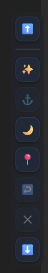
    </td>
  </tr>
</table>

### 浅色模式 (Light Mode)
<table width="100%">
  <tr>
    <th width="90%">主界面展示</th>
    <th width="10%">侧边栏收起状态</th>
  </tr>
  <tr>
    <td align="center">
      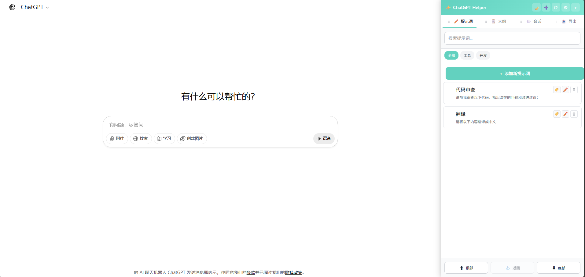
    </td>
    <td align="center">
      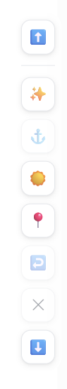
    </td>
  </tr>
</table>

### 核心功能预览

<table>
  <tr>
    <th align="center" colspan="2">会话管理 (Conversation Management)</th>
  </tr>
  <tr>
    <td align="center">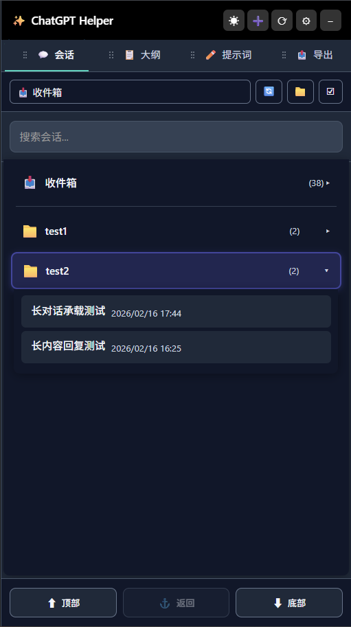</td>
    <td align="center">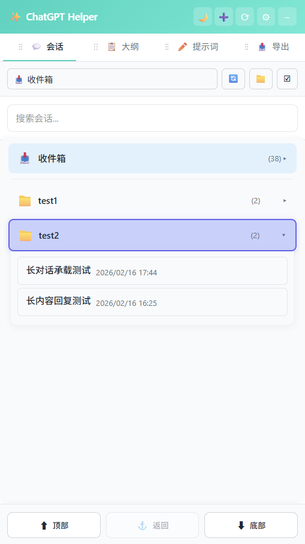</td>
  </tr>
  <tr>
    <th align="center" colspan="2">智能大纲 (Outline)</th>
  </tr>
  <tr>
    <td align="center">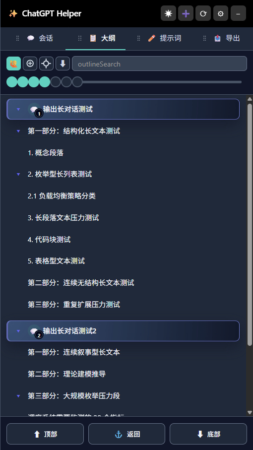</td>
    <td align="center">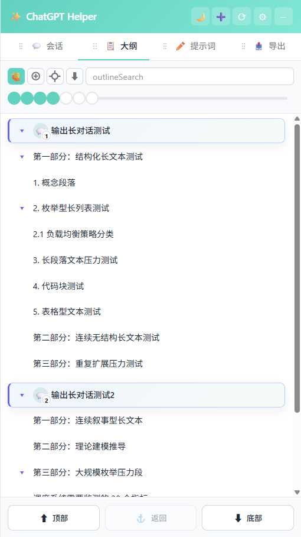</td>
  </tr>
  <tr>
    <th align="center" colspan="2">提示词库 (Prompt Manager)</th>
  </tr>
  <tr>
    <td align="center">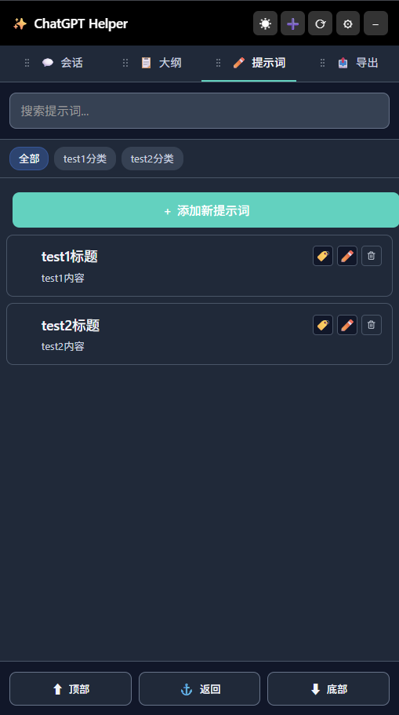</td>
    <td align="center">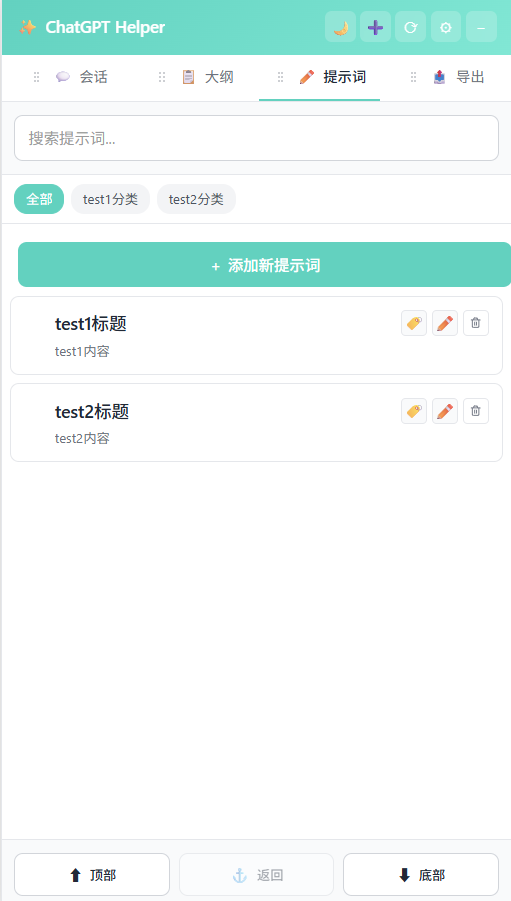</td>
  </tr>
  <tr>
    <th align="center" colspan="2">导出选项 (Export)</th>
  </tr>
  <tr>
    <td align="center">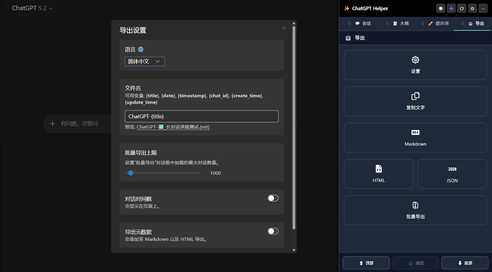</td>
    <td align="center">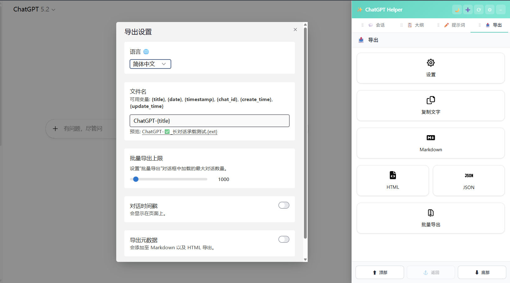</td>
  </tr>
</table>

---

## 🚀 安装指南

### 本地加载 (开发模式)

1.  **获取源码**: 克隆本仓库或下载 Release 压缩包并解压。
2.  **打开扩展管理**: 在 Chrome / Edge 地址栏输入 `chrome://extensions/`。
3.  **开启开发者模式**: 打开右上角的开关。
4.  **加载已解压的扩展程序**: 点击按钮，选择项目根目录。
5.  **开始使用**: 访问 `https://chatgpt.com`，侧边栏将自动出现。

---

## 🛠️ 项目结构

```bash
ChatGPTHelper/
├── content-scripts/
│   ├── chatgpt-helper.js          # 核心逻辑（UI、提示词、大纲）
│   ├── chatgpt-helper-exporter.js # 导出功能
│   └── gm-api-adapter.js          # API 适配器
├── libs/
│   ├── jszip.min.js               # 压缩库
│   └── html2canvas.min.js         # 截图库
├── icons/                         # 图标资源
├── docs/                          # 文档图片
├── manifest.json                  # 扩展配置
└── README.md                      # 说明文档
```

## 🧩 兼容性说明

- **浏览器**: Chrome, Edge (Manifest V3)
- **支持站点**:
    - `https://chat.openai.com/*`
    - `https://chatgpt.com/*`
    - `https://new.oaifree.com/*`

## 🔒 隐私与权限

我们重视您的隐私。**所有数据处理均在您的本地浏览器中完成。**

- **`storage`**: 仅用于在本地保存您的设置和提示词数据。
- **`notifications`**: (可选) 仅用于在导出完成时发出通知。
- **无远程服务器**: 扩展不包含任何数据上传或分析代码。

---

## 📄 许可证

本项目基于 [MIT License](LICENSE) 开源。

<div align="center">
  <sub>Built with ❤️ for the AI community</sub>
</div>
