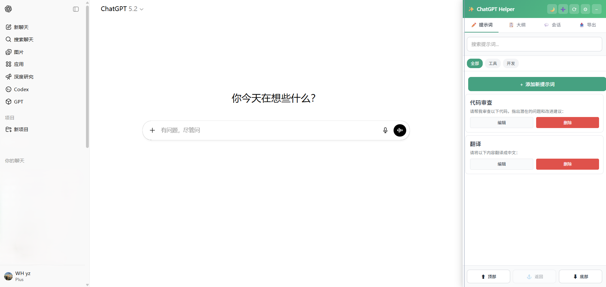
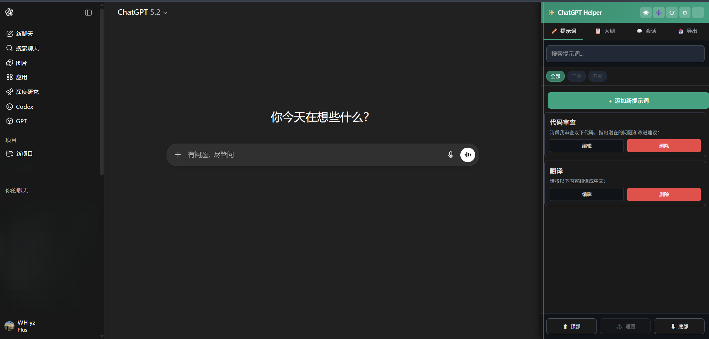
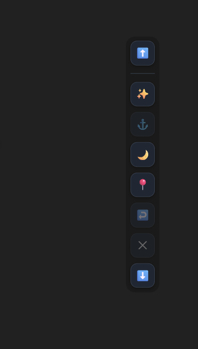
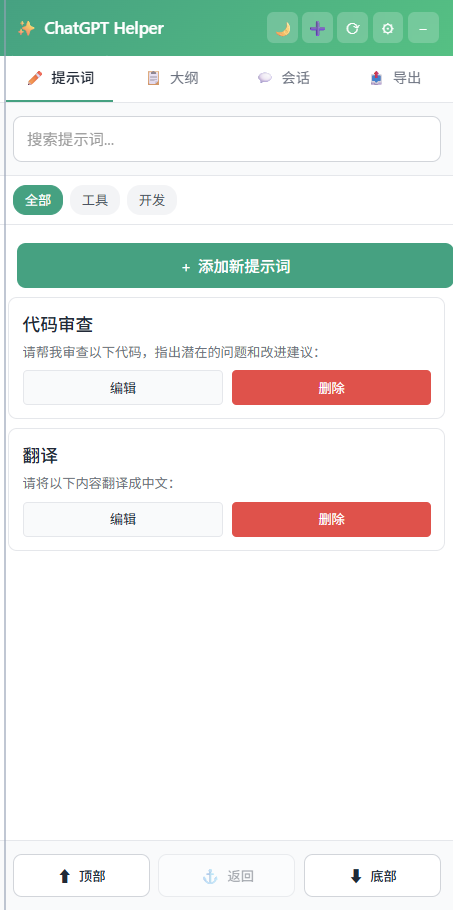
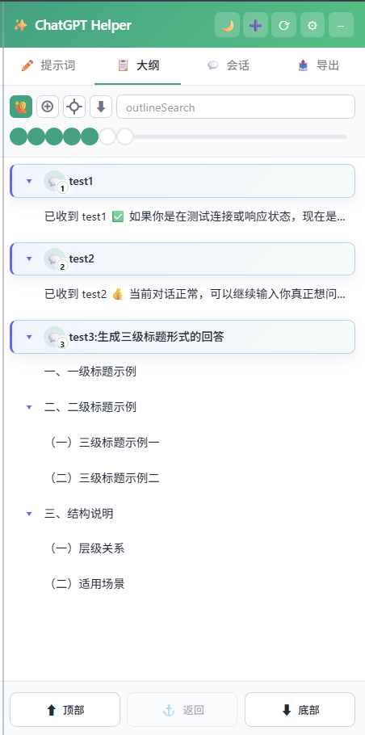
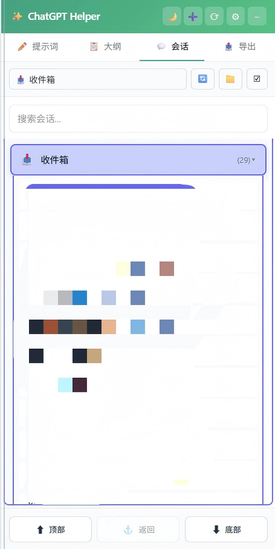
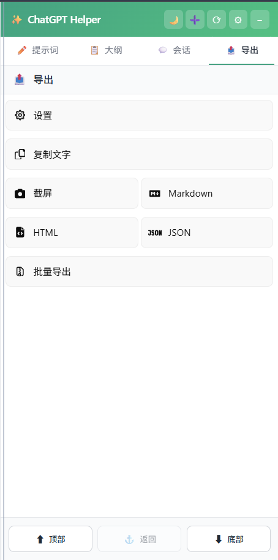

<div align="center">
  
  <h1>ChatGPT Helper</h1>
</div>

## Project Overview

ChatGPT Helper 是一个 Chrome 浏览器扩展，以极简为特色，用于增强 ChatGPT 网页界面的功能体验。通过注入内容脚本，在 ChatGPT 页面侧边栏提供辅助功能面板，实现提示词管理、对话大纲生成、会话批量操作和内容导出等功能。

**核心定位**：为 ChatGPT 用户提供高效的内容管理和组织工具。

**适用场景**：
- 需要频繁使用和管理提示词的场景
- 需要快速浏览和定位长对话内容的场景
- 需要批量管理会话和导出对话内容的场景
- 需要自定义页面布局和阅读体验的场景

## Features

- **提示词管理**：支持提示词的增删改查、分类管理和快速插入
- **对话大纲**：自动生成对话内容的大纲导航，支持快速跳转
- **会话管理**：同步并管理 ChatGPT 会话列表，支持批量操作、文件夹组织和置顶功能
- **内容导出**：支持将对话导出为 PDF、HTML、Markdown、JSON、TXT 等多种格式
- **三栏布局**：在 ChatGPT 页面右侧添加功能面板，提供可折叠的侧边栏
- **阅读锚点**：记录阅读位置，支持快速返回上次阅读位置
- **页面定制**：支持限制页面宽度、防止自动滚动等个性化设置
- **多语言支持**：支持简体中文和英文界面，自动检测语言

## Screenshots

### 主界面展示

<div align="center">
  
  <p><em>主界面 - 三栏布局与功能面板 (Light 模式)</em></p>

  
  <p><em>主界面 - 三栏布局与功能面板 (Dark 模式)</em></p>

  
  <p><em>侧边栏收起状态</em></p>
</div>

### 功能展示

<table>
<tr>
<td width="50%">
  <div align="center">
    
    <p><em>功能展示 - 提示词管理、大纲导航、会话管理、导出</em></p>
  </div>
</td>
<td width="50%">
  <div align="center">
    
    <p><em>功能展示 - 提示词管理、大纲导航、会话管理、导出</em></p>
  </div>
</td>
</tr>
<tr>
<td width="50%">
  <div align="center">
    
    <p><em>功能展示 - 提示词管理、大纲导航、会话管理、导出</em></p>
  </div>
</td>
<td width="50%">
  <div align="center">
    
    <p><em>功能展示 - 提示词管理、大纲导航、会话管理、导出</em></p>
  </div>
</td>
</tr>
</table>


## Tech Stack

- **前端**：原生 JavaScript (ES6+)
- **扩展框架**：Chrome Extension Manifest V3
- **存储**：Chrome Storage API
- **第三方库**：
  - `jszip`：用于批量导出时的文件压缩
  - `html2canvas`：用于 PDF 导出时的页面截图
- **部署环境**：Chrome/Edge 浏览器扩展商店

## Usage

### 1. 安装依赖

本项目为浏览器扩展，无需安装 Node.js 依赖。如需本地开发，可直接加载扩展。

### 2. 环境变量配置

无需配置环境变量。

### 3. 本地运行

1. 打开 Chrome 浏览器，访问 `chrome://extensions/`
2. 开启右上角「开发者模式」
3. 点击「加载已解压的扩展程序」
4. 选择项目根目录
5. 扩展安装完成后，访问 `https://chat.openai.com` 或 `https://chatgpt.com` 即可使用

### 4. 使用说明

安装完成后，访问支持的 ChatGPT 网站（`chat.openai.com`、`chatgpt.com`、`new.oaifree.com`），页面右侧会自动显示功能面板。点击面板标题栏可展开/折叠面板。

## Project Structure

```bash
ChatGPTHelper/
├── content-scripts/
│   ├── chatgpt-helper.js          # 主功能脚本（提示词、大纲、会话管理）
│   ├── chatgpt-helper-exporter.js # 导出功能脚本（PDF、HTML、Markdown）
│   └── gm-api-adapter.js          # API 适配器
├── libs/
│   ├── jszip.min.js               # ZIP 压缩库
│   └── html2canvas.min.js         # 截图库
├── icons/
│   ├── icon16.png                 # 扩展图标 16x16
│   ├── icon48.png                 # 扩展图标 48x48
│   └── icon128.png                # 扩展图标 128x128
├── docs/                           # 文档和截图目录
│   ├── screenshot-main.png        # 主界面截图
│   └── screenshot-features.png    # 功能展示截图
├── manifest.json                  # 扩展配置文件
└── README.md                      # 项目说明文档
```

## Development Notes

### 核心模块说明

- **ChatGPTAdapter**：封装与 ChatGPT 页面 DOM 交互的适配器，提供统一的 API 接口
- **ChatGPTHelper**：主控制器类，管理所有功能模块的初始化和协调
- **ScrollManager**：滚动管理模块，处理页面滚动和消息加载
- **HistoryLoader**：历史记录加载器，实现无限滚动加载对话历史
- **AnchorManager**：锚点管理器，记录和恢复阅读位置
- **OutlineManager**：大纲生成器，解析对话内容并生成导航大纲
- **CopyManager**：复制功能管理器，处理消息复制操作
- **TabRenameManager**：标签页重命名管理器

### 关键设计思路

1. **命名空间隔离**：使用 `window.__MY_EXT__` 避免全局变量污染
2. **延迟初始化**：部分模块（如 OutlineManager）采用延迟初始化策略，提升页面加载性能
3. **事件驱动**：通过观察者模式管理各模块间的通信
4. **适配器模式**：通过 ChatGPTAdapter 抽象页面交互，便于适配不同版本的 ChatGPT 界面
5. **存储策略**：使用 Chrome Storage API 持久化用户配置和提示词数据

### 兼容性说明

- 支持 Chrome/Edge 浏览器（Manifest V3）
- 支持 ChatGPT 官方站点和部分第三方镜像站点
- 通过适配器模式兼容 ChatGPT 界面更新
