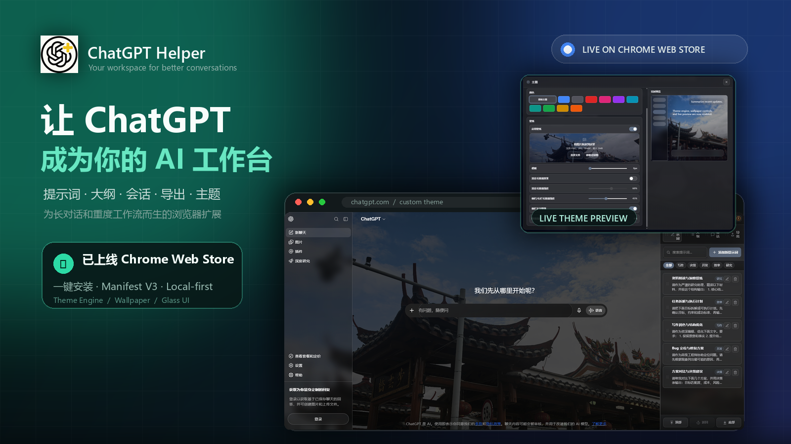
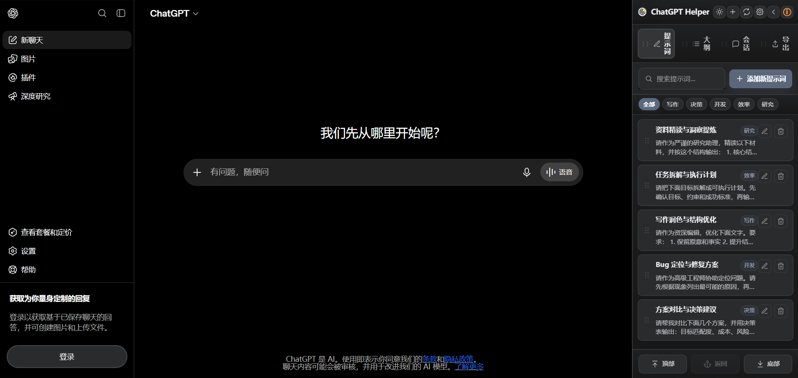
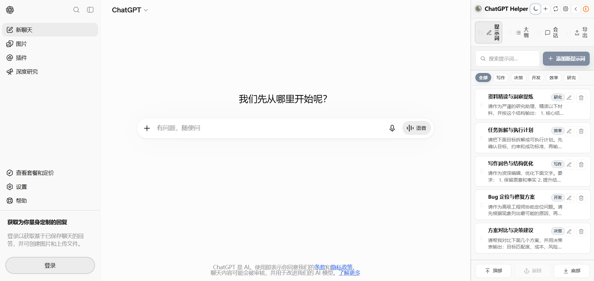
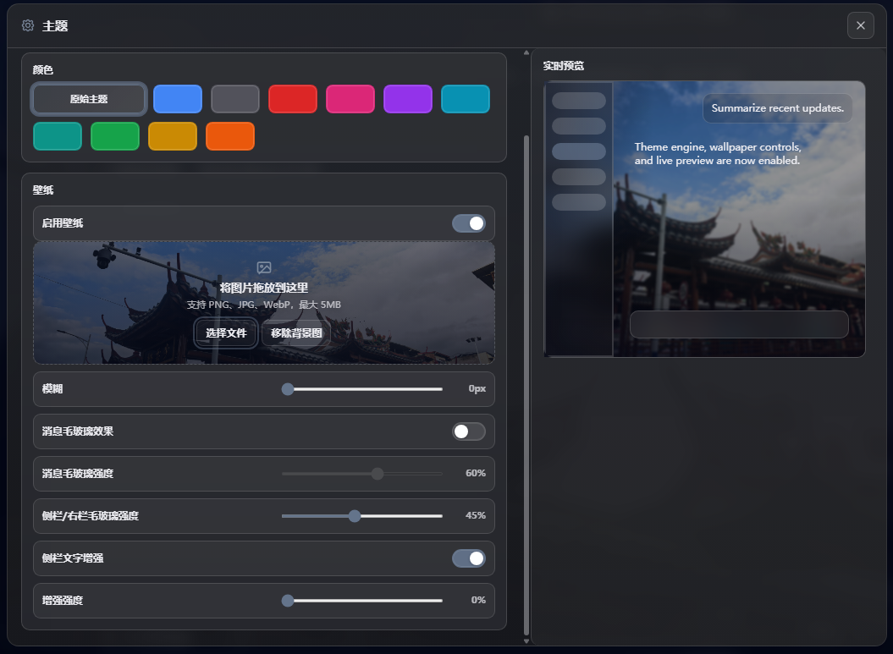
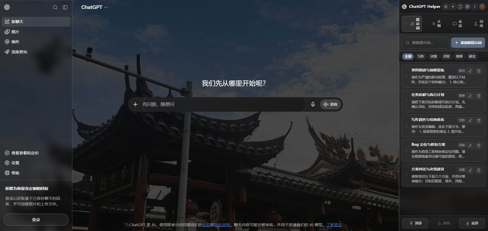
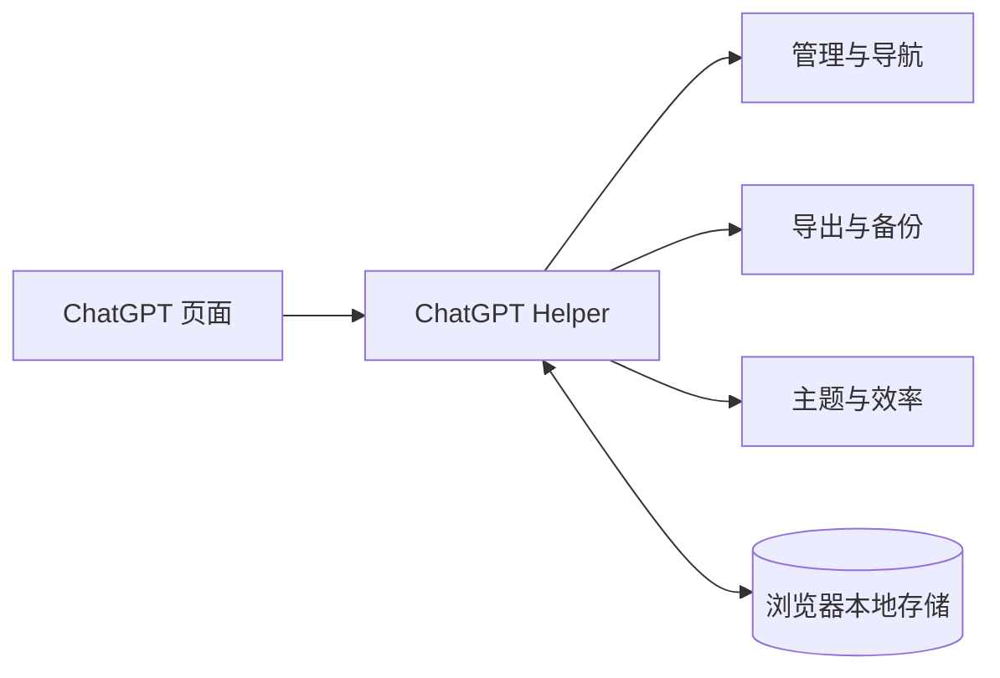

<div align="center">
  <a href="https://chromewebstore.google.com/detail/chatgpt-helper/cepillehamimekfahfbgigbpfcaphpca">
    
  </a>

  <h1>ChatGPT Helper</h1>
  <p><strong>让 ChatGPT 更适合长对话、重度工作与持续沉淀。</strong></p>

  <p>
    <a href="https://chromewebstore.google.com/detail/chatgpt-helper/cepillehamimekfahfbgigbpfcaphpca">
      
    </a>
    <a href="artifacts/chatgpt-helper-2.4.2-chrome.zip">
      
    </a>
  </p>

  <p>
    
    
    
    <a href="LICENSE"></a>
  </p>

  <p>
    <a href="#features">功能</a> ·
    <a href="#screenshots">界面</a> ·
    <a href="#installation">安装</a> ·
    <a href="#usage">使用</a> ·
    <a href="#development">开发</a> ·
    <a href="#privacy">隐私</a>
  </p>
</div>

---

> [!IMPORTANT]
> **ChatGPT Helper 已正式上线 Chrome Web Store。** 直接安装即可使用，并可接收后续商店更新。
>
> **[前往 Chrome Web Store →](https://chromewebstore.google.com/detail/chatgpt-helper/cepillehamimekfahfbgigbpfcaphpca)**

## 不只是侧边栏，而是一套 ChatGPT 工作流

ChatGPT Helper 将经常分散在不同位置的操作收拢到一个安静、清晰、可折叠的工作区中。

它适合需要长期使用 ChatGPT 进行 **研究、写作、学习、编程与知识整理** 的用户：对话再长，历史记录再多，也能快速找到、整理并导出需要的内容。

<a id="features"></a>
## 核心能力

<table>
  <tr>
    <td width="50%" valign="top">
      <sub>01 / PROMPTS</sub><br>
      <strong>提示词工作台</strong><br><br>
      搜索、分类、编辑并一键插入常用提示词。内置研究、规划、写作、调试与决策模板。
    </td>
    <td width="50%" valign="top">
      <sub>02 / OUTLINE</sub><br>
      <strong>长对话大纲</strong><br><br>
      自动提取问题和多级标题，支持滚动同步、快速跳转与阅读位置返回。
    </td>
  </tr>
  <tr>
    <td valign="top">
      <sub>03 / CONVERSATIONS</sub><br>
      <strong>会话整理</strong><br><br>
      搜索、同步、置顶、分组和批量管理历史会话，把聊天记录整理成可复用资料。
    </td>
    <td valign="top">
      <sub>04 / EXPORT</sub><br>
      <strong>导出与备份</strong><br><br>
      支持 Markdown、HTML、JSON、批量 ZIP，以及时间戳、元数据和文件名规则。
    </td>
  </tr>
  <tr>
    <td valign="top">
      <sub>05 / THEME</sub><br>
      <strong>主题与壁纸</strong><br><br>
      支持亮色、暗色、主题预设、自定义背景、模糊和玻璃效果实时预览。
    </td>
    <td valign="top">
      <sub>06 / FOCUS</sub><br>
      <strong>阅读效率增强</strong><br><br>
      提供滚动锁定、阅读历史、公式与表格复制、标签页状态和完成提示音。
    </td>
  </tr>
</table>

<a id="screenshots"></a>
## 界面预览

### 首页 · 暗色与亮色

<table>
  <tr>
    <td width="50%"></td>
    <td width="50%"></td>
  </tr>
</table>

### 主题设置 · 从配置到最终效果

<table>
  <tr>
    <td width="50%"></td>
    <td width="50%"></td>
  </tr>
</table>

<a id="installation"></a>
## 安装

### Chrome Web Store · 推荐

点击 **[添加至 Chrome](https://chromewebstore.google.com/detail/chatgpt-helper/cepillehamimekfahfbgigbpfcaphpca)**，安装后打开或刷新 [ChatGPT](https://chatgpt.com/) 即可。

### 本地安装包 · 解压即用

下载 **[chatgpt-helper-2.4.2-chrome.zip](artifacts/chatgpt-helper-2.4.2-chrome.zip)**，然后：

1. 解压 ZIP；
2. 打开 `chrome://extensions/`；
3. 开启右上角 **开发者模式**；
4. 点击 **加载已解压的扩展程序**；
5. 选择解压后直接包含 `manifest.json` 的文件夹。

> 注意：安装目录中应直接看到 `manifest.json`。如果外面还有一层同名文件夹，请选择包含 `manifest.json` 的那一层。

<a id="usage"></a>
## 使用

| 你想做什么 | 怎么操作 |
| --- | --- |
| 使用常用提示词 | 打开 **提示词**，点击模板即可插入输入框 |
| 浏览长对话 | 打开 **大纲**，点击标题快速跳转 |
| 整理历史记录 | 打开 **会话**，同步后进行搜索、置顶或分组 |
| 保存聊天内容 | 打开 **导出**，选择格式或批量导出 |
| 更换界面风格 | 点击顶部主题按钮，选择配色或上传背景图 |
| 暂时收起面板 | 点击顶部收起按钮，需要时再展开 |

## 运行结构



简而言之：扩展运行在 ChatGPT 页面中，负责组织界面与工作流；设置和索引数据保存在浏览器本地。

<a id="development"></a>
## 二次开发

### 第一次运行

```bash
npm install
npm run build
npm run check
```

然后打开 `chrome://extensions/`，选择 **加载已解压的扩展程序**，加载项目根目录。

### 修改代码后

```bash
npm run build
```

回到扩展管理页点击 **刷新**，再刷新 ChatGPT 页面即可看到修改。

### 生成发布包

```bash
npm run package
```

该命令会自动完成：

1. 构建最新代码；
2. 执行检查；
3. 清理旧发布产物；
4. 生成可直接加载的解压目录和 ZIP 安装包。

### `artifacts` 目录有什么用？

`artifacts/` 是**发布产物目录**，不参与源码开发，也不是扩展运行时依赖。

当前会生成：

```text
artifacts/
├── chatgpt-helper-2.4.2-unpacked/   # 可直接在 Chrome 中加载
└── chatgpt-helper-2.4.2-chrome.zip  # 提供给用户下载和解压
```

它可以安全删除；再次执行 `npm run package` 会完整重建。仓库中原有的 2.4.1、旧 2.4.2 商店包已经清理，避免历史文件混淆。

<details>
<summary><strong>查看源码目录</strong></summary>

```text
ChatGPT-Helper/
├── manifest.json          # 扩展入口与权限配置
├── src/content/           # 功能源码
├── content-scripts/dist/  # 构建后的浏览器脚本
├── scripts/               # 构建、检查与打包工具
├── icons/                 # 扩展图标
├── libs/                  # 浏览器端依赖
├── docs/                  # README 图片素材
└── artifacts/             # 可发布、可删除、可重建的安装产物
```

</details>

### 常用命令

| 命令 | 作用 |
| --- | --- |
| `npm run build` | 构建最新扩展脚本 |
| `npm run check` | 运行回归检查和类型检查 |
| `npm run package` | 构建、检查并生成安装包 |
| `npm run typecheck` | 仅运行 TypeScript 类型检查 |

<a id="privacy"></a>
## 隐私与权限

- 提示词、界面设置、主题配置与会话索引保存在浏览器本地；
- 不向开发者自建服务器上传数据；
- 会话同步与批量导出使用当前登录状态访问 ChatGPT 官方接口；
- `storage` 用于保存本地数据；
- `notifications` 用于可选的完成提醒；
- 站点权限仅覆盖 `chatgpt.com` 与 `chat.openai.com`。

## 兼容性

| 环境 | 状态 |
| --- | --- |
| Google Chrome | ✅ 推荐 |
| Microsoft Edge | ✅ 支持 Chromium 扩展 |
| `chatgpt.com` | ✅ 支持 |

## 反馈与贡献

- [提交问题](https://github.com/zhiwuyazhe-fjr/ChatGPT-Helper/issues/new)
- [查看源码](https://github.com/zhiwuyazhe-fjr/ChatGPT-Helper)
- [Chrome Web Store](https://chromewebstore.google.com/detail/chatgpt-helper/cepillehamimekfahfbgigbpfcaphpca)

本项目基于 [MIT License](LICENSE) 开源。


<div align="center">
  <strong>让对话更清晰，让内容真正沉淀下来</strong>
</div>